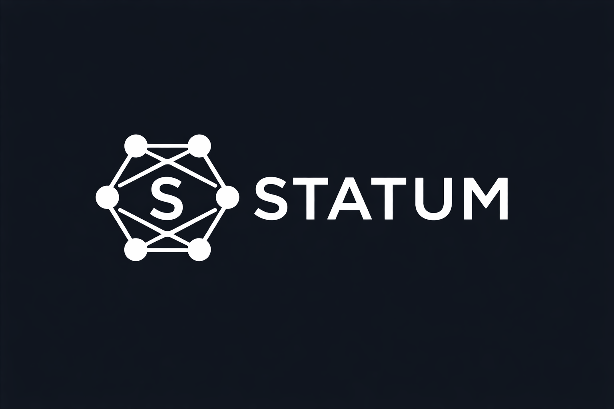

<div align="center">
  <picture>
    <source media="(prefers-color-scheme: dark)" srcset="./docs/static/image/logo-dark.png">
    
  </picture>
  <p>Statum is a Rust typestate framework for making invalid, undesirable, or not-yet-validated states unrepresentable in ordinary code.</p>
  <p>
    <a href="https://github.com/eboody/statum/actions/workflows/ci.yml"></a>
    <a href="https://crates.io/crates/statum"></a>
    <a href="https://docs.rs/statum"></a>
  </p>
</div>

# Statum

Statum is about correctness. More specifically, it is about representational
correctness: how accurately your code models the thing you are trying to model.

The goal is to make invalid, undesirable, or not-yet-validated states
impossible to represent in ordinary code. In that sense it is similar to
`Option` or `Result`: they make absence or failure explicit in the type system
instead of leaving it implicit.

Statum applies that same idea to workflow and protocol state. You describe
lifecycle phases with `#[state]`, durable context with `#[machine]`, legal
moves with `#[transition]`, and typed rehydration from existing data with
`#[validators]`.

It is opinionated on purpose: explicit transitions, state-specific data, and compile-time method gating. If that is the shape of your problem, the API stays small and the safety payoff is high.

## Install

Statum targets stable Rust and currently supports Rust `1.93+`.

```toml
[dependencies]
statum = "0.6.3"
```

## 60-Second Example

```rust
use statum::{machine, state, transition};

#[state]
enum LightState {
    Off,
    On,
}

#[machine]
struct LightSwitch<LightState> {
    name: String,
}

#[transition]
impl LightSwitch<Off> {
    fn switch_on(self) -> LightSwitch<On> {
        self.transition()
    }
}

#[transition]
impl LightSwitch<On> {
    fn switch_off(self) -> LightSwitch<Off> {
        self.transition()
    }
}

fn main() {
    let light = LightSwitch::<Off>::builder()
        .name("desk lamp".to_owned())
        .build();

    let light = light.switch_on();
    let _light = light.switch_off();
}
```

Example: [statum-examples/src/toy_demos/example_01_setup.rs](statum-examples/src/toy_demos/example_01_setup.rs)

## What The Compiler Enforces

The syntax example above is small. The point is not the syntax. The point is
that legal and illegal states stop looking the same in your API.

The workflow shape becomes part of the type system instead of hiding in status
enums, optional fields, and comments:

- `LightSwitch<Off>` and `LightSwitch<On>` are different types.
- `switch_on()` only exists on `LightSwitch<Off>`.
- `switch_off()` only exists on `LightSwitch<On>`.
- If a state carries data, that data only exists when the machine is actually
  in that state.

This is the point of Statum: only legal, understood states become first-class
values. Raw rows and event projections stay raw until `#[validators]` proves
they can become typed machines.

If you add derives, place them below `#[state]` and `#[machine]`:

```rust
#[machine]
#[derive(Debug, Clone)]
struct LightSwitch<LightState> {
    name: String,
}
```

That avoids the common `missing fields marker and state_data` error.

## Mental Model

```text
#[state]      -> lifecycle phases
#[machine]    -> durable machine context
#[transition] -> legal edges between phases
#[validators] -> typed rehydration from stored data
```

Roughly, Statum generates:

- Marker types for each state variant, such as `Off` and `On`.
- A machine type parameterized by the current state, with hidden `marker` and `state_data` fields.
- Builders for new machines, such as `LightSwitch::<Off>::builder()`.
- A machine-scoped enum like `task_machine::SomeState` for matching reconstructed machines.
  `task_machine::State` remains an alias for compatibility.
- A machine-scoped `task_machine::Fields` struct for batch rebuilds where each row needs different machine context.
- A machine-scoped batch rehydration trait like `task_machine::IntoMachinesExt`.

This is the whole model. The rest of the crate is about making those four pieces ergonomic.

> Typed rehydration is the unusual part: if you already have rows, events, or persisted workflow data, `#[validators]` can rebuild them into typed machines. Full example below.

If you are evaluating Statum from the outside, start with
[docs/start-here.md](docs/start-here.md). For a guided app-shaped walkthrough
that starts minimal and adds features one by one, see
[docs/tutorial-review-workflow.md](docs/tutorial-review-workflow.md). For the
flagship persistence story, see
[docs/case-study-event-log-rebuild.md](docs/case-study-event-log-rebuild.md).

## Typed Rehydration

`#[validators]` is the feature that turns stored data back into typed machines. Each `is_*` method checks whether the persisted value belongs to a state, returns `()` or state-specific data, and Statum builds the right typed output:

```rust
use statum::{machine, state, validators};

#[state]
enum TaskState {
    Draft,
    InReview(ReviewData),
    Published,
}

struct ReviewData {
    reviewer: String,
}

#[machine]
struct TaskMachine<TaskState> {
    client: String,
    name: String,
}

enum Status {
    Draft,
    InReview,
    Published,
}

struct DbRow {
    status: Status,
}

#[validators(TaskMachine)]
impl DbRow {
    fn is_draft(&self) -> statum::Result<()> {
        let _ = (&client, &name);
        if matches!(self.status, Status::Draft) {
            Ok(())
        } else {
            Err(statum::Error::InvalidState)
        }
    }

    fn is_in_review(&self) -> statum::Result<ReviewData> {
        let _ = &name;
        if matches!(self.status, Status::InReview) {
            Ok(ReviewData {
                reviewer: format!("reviewer-for-{client}"),
            })
        } else {
            Err(statum::Error::InvalidState)
        }
    }

    fn is_published(&self) -> statum::Result<()> {
        if matches!(self.status, Status::Published) {
            Ok(())
        } else {
            Err(statum::Error::InvalidState)
        }
    }
}

fn main() -> statum::Result<()> {
    let row = DbRow {
        status: Status::InReview,
    };

    let machine = row
        .into_machine()
        .client("acme".to_owned())
        .name("spec".to_owned())
        .build()?;

    match machine {
        task_machine::SomeState::Draft(_) => {}
        task_machine::SomeState::InReview(task) => {
            assert_eq!(task.state_data.reviewer.as_str(), "reviewer-for-acme");
        }
        task_machine::SomeState::Published(_) => {}
    }

    Ok(())
}
```

Key details:

- Validator methods run against your persisted type and return either `Ok(...)` for the matching state or `Err(statum::Error::InvalidState)`.
- Machine fields are available by name inside validator methods through generated bindings, so `client` and `name` are usable without boilerplate parameter plumbing. Persisted-row fields still live on `self`.
- Unit states return `statum::Result<()>`; data-bearing states return `statum::Result<StateData>`.
- `.build()` returns the generated wrapper enum, which you can match as `task_machine::SomeState`.
  `task_machine::State` is kept as an alias so older code still compiles.
- If any validator is `async`, the generated builder becomes `async`.
- Use `.into_machines_by(|row| task_machine::Fields { ... })` when batch reconstruction needs different machine fields per row.
- For append-only event logs, project events into validator rows first. `statum::projection::reduce_one` and `reduce_grouped` are the small helper layer for that.
- If no validator matches, `.build()` returns `statum::Error::InvalidState`.

Examples: [statum-examples/src/toy_demos/09-persistent-data.rs](statum-examples/src/toy_demos/09-persistent-data.rs), [statum-examples/src/toy_demos/10-persistent-data-vecs.rs](statum-examples/src/toy_demos/10-persistent-data-vecs.rs), [statum-examples/src/toy_demos/14-batch-machine-fields.rs](statum-examples/src/toy_demos/14-batch-machine-fields.rs), [statum-examples/src/showcases/sqlite_event_log_rebuild.rs](statum-examples/src/showcases/sqlite_event_log_rebuild.rs)

More detail: [docs/persistence-and-validators.md](docs/persistence-and-validators.md)

## Core Rules

`#[state]`

- Apply it to an enum.
- Variants must be unit variants or single-field tuple variants.
- Generics on the state enum are not supported.

`#[machine]`

- Apply it to a struct.
- The first generic parameter must match the `#[state]` enum name.
- Put `#[machine]` above `#[derive(...)]`.

`#[transition]`

- Apply it to `impl Machine<State>` blocks that define legal transitions.
- Transition methods must take `self` or `mut self`.
- Return `Machine<NextState>` directly, or wrap it in `Result` / `Option` when the transition is conditional.
- Use `transition_with(data)` when the target state carries data.

`#[validators]`

- Use `#[validators(Machine)]` on an `impl` block for your persisted type.
- Define one `is_{state}` method per state variant.
- Return `statum::Result<()>` for unit states or `statum::Result<StateData>` for data-bearing states.
- Prefer `into_machine()` for single-item reconstruction.
- For collections that share machine fields, call `.into_machines()`.
- For collections where machine fields vary per item, call `.into_machines_by(|row| machine::Fields { ... })`.
- From other modules, import `machine::IntoMachinesExt as _` first.

## When To Use Statum

Use Statum when:

- You care about representational correctness and want invalid, undesirable, or
  not-yet-validated states out of the core API.
- Workflow order is stable and meaningful.
- Invalid transitions are expensive.
- Available methods should change by phase.
- Some data is only valid in specific states.

Do not use Statum when:

- The workflow is highly ad hoc or user-authored.
- Branching is mostly runtime business logic.
- States are still changing faster than the API around them.

More design guidance: [docs/typestate-builder-design-playbook.md](docs/typestate-builder-design-playbook.md)

## Common Gotchas

**`missing fields marker and state_data`**

Your derives expanded before `#[machine]`. Put `#[machine]` above `#[derive(...)]`.

**Transition helpers in the wrong place**

Keep non-transition helpers in normal `impl` blocks. `#[transition]` is for protocol edges, not general utility methods.

**State shape errors**

`#[state]` accepts unit variants and single-field tuple variants only.

## Showcases

For real service-shaped examples, run one of these:

```bash
cargo run -p statum-examples --bin axum-sqlite-review
cargo run -p statum-examples --bin clap-sqlite-deploy-pipeline
cargo run -p statum-examples --bin sqlite-event-log-rebuild
cargo run -p statum-examples --bin tokio-sqlite-job-runner
cargo run -p statum-examples --bin tokio-websocket-session
```

- `axum-sqlite-review` demonstrates `#[validators]` rebuilding typed machines from database rows before each HTTP transition.
- `clap-sqlite-deploy-pipeline` demonstrates repeated CLI invocations, SQLite-backed typed rehydration, and explicit apply/failure/rollback phases.
- `sqlite-event-log-rebuild` demonstrates append-only event storage, projection-based typed rehydration, and batch `.into_machines()` reconstruction.
- `tokio-sqlite-job-runner` demonstrates retries, leases, async side effects, and typed rehydration in a background worker loop.
- `tokio-websocket-session` demonstrates protocol-safe frame handling, phase-gated behavior, and a session lifecycle that is not persistence-driven.

Start with the guided review tutorial if you want one example explained in
order:
[docs/tutorial-review-workflow.md](docs/tutorial-review-workflow.md).

Start with `sqlite-event-log-rebuild` if you want the strongest “why Statum”
example:
[docs/case-study-event-log-rebuild.md](docs/case-study-event-log-rebuild.md).

## Use With Coding Agents

If you use coding agents, Statum ships an adoption kit with copyable instruction
templates, audit heuristics, and prompts for targeted refactors and reviews.
Start with [docs/agents/README.md](docs/agents/README.md).

If you are starting from an architecture memo or protocol guide rather than
from code, use the prompts under `docs/agents/prompts/`. If you use Codex
locally, an explicit `statum-skill` works well as a deeper layer on top
of the conservative templates in this repo.

## Learn More

- Toy demos: [statum-examples/src/toy_demos/](statum-examples/src/toy_demos/)
- Showcase apps: [statum-examples/src/showcases/](statum-examples/src/showcases/)
- Crate docs: [statum](https://docs.rs/statum), [statum-core](https://docs.rs/statum-core), [statum-macros](https://docs.rs/statum-macros)
- Review showcase binary: [statum-examples/src/bin/axum-sqlite-review.rs](statum-examples/src/bin/axum-sqlite-review.rs)
- Deploy pipeline binary: [statum-examples/src/bin/clap-sqlite-deploy-pipeline.rs](statum-examples/src/bin/clap-sqlite-deploy-pipeline.rs)
- Event log binary: [statum-examples/src/bin/sqlite-event-log-rebuild.rs](statum-examples/src/bin/sqlite-event-log-rebuild.rs)
- Job runner binary: [statum-examples/src/bin/tokio-sqlite-job-runner.rs](statum-examples/src/bin/tokio-sqlite-job-runner.rs)
- Session binary: [statum-examples/src/bin/tokio-websocket-session.rs](statum-examples/src/bin/tokio-websocket-session.rs)
- Coding-agent kit: [docs/agents/README.md](docs/agents/README.md)
- Start here: [docs/start-here.md](docs/start-here.md)
- Guided review tutorial: [docs/tutorial-review-workflow.md](docs/tutorial-review-workflow.md)
- Event-log case study: [docs/case-study-event-log-rebuild.md](docs/case-study-event-log-rebuild.md)
- Typed rehydration and validators: [docs/persistence-and-validators.md](docs/persistence-and-validators.md)
- Patterns and advanced usage: [docs/patterns.md](docs/patterns.md)
- Typestate builder design playbook: [docs/typestate-builder-design-playbook.md](docs/typestate-builder-design-playbook.md)
- API docs: [docs.rs/statum](https://docs.rs/statum)

## Stability

- Stable Rust is the target.
- MSRV: `1.93`
